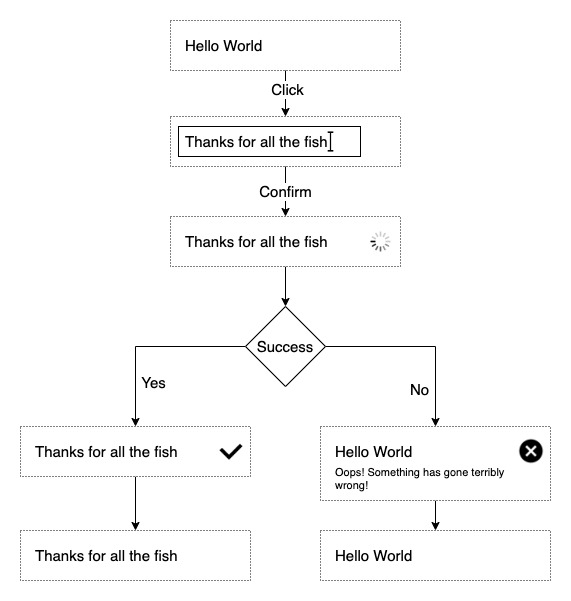

## Coyote-Test
This application follows a Users journey into entering a word into a input field which results in a Mock Promise being triggered. 

### Validation
-   Successful Promise: A user enters less than 10 characters into the input field. 
-   Unsuccesful Promise: A user enters more than 10 characters in the input field. 

### Tech Stack 
-   UI: React.js
-   Styling: styled-components 

### To set Up Project
-   Clone Repo: git clone git@github.com:SHUBV92/coyote.git
-   CD into directory named: coyote-ui-interview
-   Run: npm start 

### User Journey Wireframe

